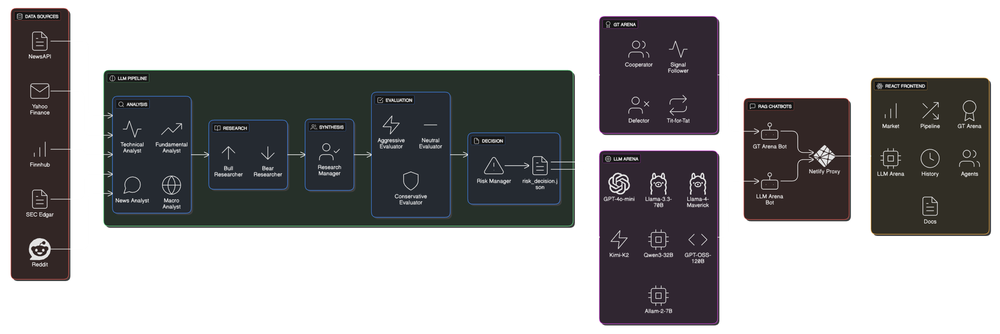
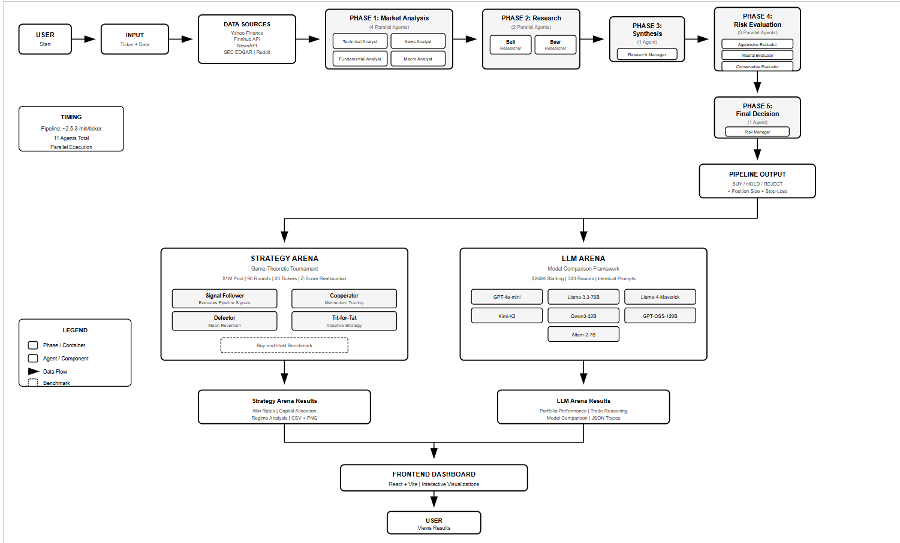

# Trade Arena - A MATS (Multi-Agent Trading System)

A comprehensive AI-driven trading analysis system that coordinates 11+ specialized LLM agents working collaboratively to analyze stocks, debate investment theses, and produce risk-adjusted trading decisions—with game-theoretic validation to test strategy performance across market regimes.

## Architecture Overview

<p align="center">
  
</p>

## User Flow

<p align="center">
  
</p>


[](https://tradearena.site)

**Authors:** Priyam Choksi & Vishodhan Krishnan  
**Course:** DAMG 7374 | Northeastern University | Fall 2025

---

## ⚠️ IMPORTANT DISCLAIMER

**This project is designed for research and academic purposes only.** It is NOT intended for making real financial decisions or actual trading. The system is an experimental framework for studying multi-agent collaboration, game theory, and AI-driven decision-making. Users must conduct their own financial analysis and consult with licensed financial advisors before making any investment decisions. The authors assume no responsibility for financial losses or decisions made based on this system's outputs.

---

## Table of Contents

- [Overview](#overview)
- [Key Results](#key-results)
- [Architecture Overview](#architecture-overview)
- [The 11 Agents](#the-11-agents-detailed)
- [Strategy Arena](#strategy-arena-game-theory-tournament)
- [LLM Arena](#llm-arena-model-comparison)
- [Quick Start](#quick-start)
- [Project Structure](#project-structure)
- [Configuration](#configuration)
- [API Reference](#api-reference)
- [Sample Outputs](#sample-outputs)
- [Data Sources](#data-sources)
- [Understanding the Output](#understanding-the-output)
- [Troubleshooting](#troubleshooting)
- [Research Methodology](#research-methodology)
- [Key Findings](#key-findings)
- [Demo & Resources](#demo--resources)

---

## Overview

Trade Arena answers one research question: **Do different trading strategies perform optimally under different market regimes?**

We test this by building three interconnected systems:

| System | Description | Scale |
|--------|-------------|-------|
| **Analysis Pipeline** | 11 LLM agents across 5 phases process market data | 35,000+ workflow outputs |
| **Strategy Arena** | 4 game-theoretic strategies compete for shared capital | 1,800 tournament rounds |
| **LLM Arena** | 7 language models compete on identical trading tasks | 2,695 competition rounds |

### Why This Matters

Traditional backtesting runs strategies in isolation. Trade Arena creates **genuine strategic interdependence**—your returns depend on what other strategies do. This mirrors real markets where traders compete for the same alpha.

### System Workflow

1. **Phase 1: Market Analysis** → Four analyst agents (Technical, News, Fundamental, Macro) gather and analyze market signals
2. **Phase 2: Research Deep Dive** → Bull and Bear researchers construct opposing investment theses
3. **Phase 3: Debate & Synthesis** → Research Manager facilitates debate and synthesizes findings
4. **Phase 4: Risk Evaluation** → Three risk evaluators (Aggressive, Neutral, Conservative) assess from different perspectives
5. **Phase 5: Final Decision** → Risk Manager makes final BUY/HOLD/REJECT decision with position sizing

---

## Key Results

### Strategy Arena Performance (1,800 rounds, 20 tickers)

| Strategy | Return | Signal Accuracy | Best Regime |
|----------|--------|-----------------|-------------|
| **Signal Follower** | +14.93% | 73.2% | Bull markets |
| **Cooperator** | +10.34% | — | Trending markets |
| **Defector** | -4.24% (overall) / +6.2% (bear) | — | Bear markets |
| **Tit-for-Tat** | -12.64% | — | Regime transitions |
| *Buy-and-Hold (benchmark)* | +12.45% | — | — |

**Signal Follower generated +2.48% alpha over passive investing.**

### LLM Arena Performance (383 rounds)

| Rank | Model | Return | Trades |
|------|-------|--------|--------|
| 🥇 | Llama-3.3-70B | +32.63% | 280 |
| 🥈 | Qwen3-32B | +32.19% | 365 |
| 🥉 | Kimi-K2 | +30.29% | 1,068 |
| 4 | GPT-OSS-120B | +29.88% | 1,408 |
| 5 | GPT-4o-mini | +24.38% | 87 |
| 6 | Allam-2-7B | +21.40% | 25 |
| 7 | Llama-4-Maverick | +21.03% | 474 |

### Key Finding

**No single strategy dominates all conditions.** Market regime matters more than strategy selection:
- Signal Follower excels in bull markets (+18.2%)
- Defector wins in bear markets (+6.2%)
- Cooperation rate across strategies: 78%

---

## Architecture Overview

```
┌─────────────────────────────────────────────────────────────────────────┐
│                           DATA LAYER                                     │
│  Yahoo Finance │ Finnhub │ NewsAPI │ SEC Edgar │ Reddit (PRAW)          │
└─────────────────────────────────────────────────────────────────────────┘
                                    │
                                    ▼
┌─────────────────────────────────────────────────────────────────────────┐
│                     11-AGENT ANALYSIS PIPELINE                           │
│                                                                          │
│  Phase 1: Market Analysis (parallel, ~60s)                               │
│  ┌──────────┐ ┌──────────┐ ┌─────────────┐ ┌───────────┐                │
│  │Technical │ │   News   │ │Fundamental  │ │   Macro   │                │
│  │  Agent   │ │  Agent   │ │   Agent     │ │   Agent   │                │
│  └────┬─────┘ └────┬─────┘ └──────┬──────┘ └─────┬─────┘                │
│       └────────────┴───────────────┴─────────────┘                       │
│                            │                                             │
│                   ┌────────▼────────┐                                   │
│                   │ Discussion Hub  │  Synthesizes analyst outputs      │
│                   └────────┬────────┘                                   │
│                            │                                             │
│  Phase 2: Research (parallel, ~40s)                                      │
│  ┌─────────────────┐    ┌─────────────────┐                             │
│  │ Bull Researcher │    │ Bear Researcher │                             │
│  │   (bullish)     │    │   (bearish)     │                             │
│  └────────┬────────┘    └────────┬────────┘                             │
│           └──────────┬───────────┘                                       │
│                      ▼                                                   │
│  Phase 3: Synthesis (sequential, ~30s)                                   │
│  ┌─────────────────────────┐                                            │
│  │    Research Manager     │  Debate rounds + probability weighting     │
│  └───────────┬─────────────┘                                            │
│              ▼                                                           │
│  Phase 4: Risk Evaluation (parallel, ~30s)                               │
│  ┌──────────┐ ┌──────────┐ ┌──────────────┐                             │
│  │Aggressive│ │ Neutral  │ │Conservative  │                             │
│  │(STRONG   │ │ (HOLD)   │ │  (AVOID)     │                             │
│  │  BUY)    │ │          │ │              │                             │
│  └────┬─────┘ └────┬─────┘ └──────┬───────┘                             │
│       └────────────┴──────────────┘                                      │
│                    │                                                     │
│  Phase 5: Decision (sequential, ~10s)                                    │
│  ┌─────────────────────────┐                                            │
│  │     Risk Manager        │  BUY/HOLD/REJECT + position sizing         │
│  └─────────────────────────┘                                            │
└─────────────────────────────────────────────────────────────────────────┘
                                    │
                    ┌───────────────┴───────────────┐
                    ▼                               ▼
┌─────────────────────────────┐   ┌─────────────────────────────┐
│      STRATEGY ARENA         │   │        LLM ARENA            │
│                             │   │                             │
│  4 strategies compete for   │   │  7 models compete on        │
│  $1M shared capital pool    │   │  identical trading tasks    │
│                             │   │                             │
│  • Signal Follower (LLM)    │   │  • GPT-4o-mini              │
│  • Cooperator (Momentum)    │   │  • Llama-3.3-70B            │
│  • Defector (Mean Reversion)│   │  • Llama-4-Maverick         │
│  • Tit-for-Tat (Adaptive)   │   │  • Kimi-K2                  │
│                             │   │  • Qwen3-32B                │
│  Z-score reallocation after │   │  • GPT-OSS-120B             │
│  each round                 │   │  • Allam-2-7B               │
└─────────────────────────────┘   └─────────────────────────────┘
```

**Total Pipeline Runtime:** ~3 minutes per ticker

---

## The 11 Agents (Detailed)

### Phase 1: Market Analysis (Parallel Execution)

| Agent | File | Function | Key Outputs |
|-------|------|----------|-------------|
| **Technical Analyst** | `technical_agent.py` | Price pattern analysis | RSI, MACD, Bollinger Bands, support/resistance |
| **News Analyst** | `news_agent.py` | Multi-source sentiment | Sentiment score (-1 to +1), key headlines |
| **Fundamental Analyst** | `fundamental_agent.py` | Financial metrics | P/E, P/B, margins, valuation assessment |
| **Macro Analyst** | `macro_agent.py` | Market regime detection | RISK-ON/RISK-OFF/NEUTRAL, sector rotation |

#### Technical Indicators Calculated

```python
# RSI (14-period)
delta = df['Close'].diff()
gain = delta.where(delta > 0, 0).rolling(14).mean()
loss = (-delta.where(delta < 0, 0)).rolling(14).mean()
rsi = 100 - (100 / (1 + gain / loss))

# MACD (12/26/9)
ema_12 = df['Close'].ewm(span=12).mean()
ema_26 = df['Close'].ewm(span=26).mean()
macd = ema_12 - ema_26
signal = macd.ewm(span=9).mean()

# Bollinger Bands (20-period, 2 std)
sma_20 = df['Close'].rolling(20).mean()
std_20 = df['Close'].rolling(20).std()
upper_band = sma_20 + (2 * std_20)
lower_band = sma_20 - (2 * std_20)

# Also calculates: ATR, Stochastic, SMA_5, EMA_10, SMA_20, SMA_50
```

#### Market Regime Detection

```python
def detect_regime():
    # VIX-based classification
    if vix < 15: regime = "complacent"
    elif vix < 25: regime = "normal"  
    elif vix < 35: regime = "fearful"
    else: regime = "crisis"
    
    # Trend confirmation
    above_50ma = spy_price > spy_sma_50
    above_200ma = spy_price > spy_sma_200
    
    # Sector rotation analysis
    cyclical_leading = xlk_return > xlu_return  # Tech vs Utilities
    
    return "RISK-ON" if vix < 18 and above_50ma else "RISK-OFF"
```

### Phase 2: Research (Parallel Execution)

| Agent | File | Role | Default Bias |
|-------|------|------|--------------|
| **Bull Researcher** | `bull_researcher.py` | Builds bullish thesis | Optimistic |
| **Bear Researcher** | `bear_researcher.py` | Builds bearish thesis | Pessimistic |

Both researchers receive Phase 1 outputs and construct comprehensive investment theses with:
- Price targets (upside/downside)
- Key catalysts or risks
- Timeline for thesis to play out
- Confidence level

### Phase 3: Synthesis (Sequential)

| Agent | File | Role |
|-------|------|------|
| **Research Manager** | `research_manager.py` | Moderates debate, assigns probability weights |

The Research Manager:
1. Facilitates structured debate between bull and bear cases
2. Evaluates argument strength and evidence quality
3. Assigns probability weights to each thesis
4. Synthesizes into a unified recommendation

### Phase 4: Risk Evaluation (Parallel Execution)

| Agent | File | Personality | Default Stance | Position Range |
|-------|------|-------------|----------------|----------------|
| **Aggressive Evaluator** | `aggressive_debator.py` | Risk-seeking | STRONG BUY | 50-100% |
| **Neutral Evaluator** | `neutral_debator.py` | Balanced | HOLD | 25-45% |
| **Conservative Evaluator** | `conservative_debator.py` | Risk-averse | AVOID | 5-20% |

### Phase 5: Final Decision (Sequential)

| Agent | File | Role | Output |
|-------|------|------|--------|
| **Risk Manager** | `risk_manager.py` | Final arbiter with veto power | BUY/HOLD/REJECT + position size + stop-loss + targets |

The Risk Manager:
- Aggregates all evaluator recommendations
- Has **veto power** over all recommendations
- Determines exact position sizing based on portfolio value
- Sets stop-loss and profit target levels

---

## Strategy Arena: Game Theory Tournament

### How It Works

Four strategies compete for a **$1M shared capital pool** over 90 rounds per ticker. This isn't parallel backtesting—capital flows between strategies based on relative performance via **z-score reallocation**.

### The 4 Strategies

#### 1. Signal Follower (LLM Strategy)
```python
def decide_position(market, game):
    # Read evaluator positions from pipeline output
    aggressive = market.aggressive_position   # 0.0-1.0
    neutral = market.neutral_position
    conservative = market.conservative_position
    
    # Follow strongest signal if above threshold (0.12)
    if max(aggressive, neutral, conservative) > BULLISH_THRESHOLD:
        base = max(aggressive, neutral, conservative)
    else:
        base = (aggressive + neutral + conservative) / 3
    
    # Scale and apply consensus multiplier (0.7-1.3x)
    position = base * 100 * SCALE_FACTOR * consensus_mult
    return clamp(position, MIN_POSITION, MAX_POSITION)  # 15-90%
```
**Best in:** Bull markets | **Return:** +14.93% | **Accuracy:** 73.2%

#### 2. Cooperator (Momentum Strategy)
```python
def decide_position(market, game):
    # Look at last 3 rounds of returns
    recent_returns = [r.market_return for r in game.rounds[-3:]]
    avg_return = sum(recent_returns) / len(recent_returns)
    
    if avg_return > 0.015:    return 75-90%   # Strong uptrend
    elif avg_return > 0.005:  return 55-70%   # Mild uptrend
    elif avg_return > -0.005: return 40-55%   # Neutral
    elif avg_return > -0.015: return 25-40%   # Mild downtrend
    else:                     return 15-25%   # Strong downtrend
```
**Best in:** Trending markets | **Return:** +10.34%

#### 3. Defector (Mean Reversion Strategy)
```python
def decide_position(market, game):
    last_return = game.rounds[-1].market_return
    
    if last_return > 0.02:    return 25-35%   # Overbought → reduce
    elif last_return < -0.02: return 70-85%   # Oversold → expect bounce
    else:                     return llm_signal
```
**Best in:** Bear markets | **Return:** -4.24% overall, +6.2% in bear markets

#### 4. Tit-for-Tat (Adaptive Strategy)
```python
def decide_position(market, game):
    winner = game.last_winner
    winner_position = game.last_positions[winner]
    streak = count_consecutive_wins(winner)
    
    # Copy weight increases with winner's streak (50-90%)
    copy_weight = min(0.9, 0.5 + streak * 0.1)
    position = copy_weight * winner_position + (1 - copy_weight) * llm_signal
    return position
```
**Best in:** Regime transitions | **Return:** -12.64%

### Z-Score Capital Reallocation

After each round, capital flows from losers to winners:

```python
def reallocate(returns, allocations, pool, rate=0.10):
    # 1. Calculate z-scores (standardized performance)
    mean = np.mean(returns)
    std = np.std(returns)
    z_scores = [(r - mean) / std for r in returns]
    
    # 2. Transfer capital based on z-score
    for strategy, z in zip(strategies, z_scores):
        transfer = rate * pool * z
        allocations[strategy] += transfer
    
    # Sum of transfers = 0 (zero-sum game)
```

**Example Round:**
| Strategy | Return | Z-Score | Transfer |
|----------|--------|---------|----------|
| Signal Follower | +0.9% | +1.2 | +$30,000 |
| Cooperator | +0.6% | +0.3 | +$7,500 |
| Defector | -0.3% | -0.8 | -$20,000 |
| Tit-for-Tat | -0.2% | -0.7 | -$17,500 |

---

## LLM Arena: Model Comparison

### The 7 Competing Models

| Model | Provider | API | Characteristics |
|-------|----------|-----|-----------------|
| GPT-4o-mini | OpenAI | `api.openai.com` | Balanced, quick decisions |
| Llama-3.3-70B | Meta | Groq | Thorough multi-factor analysis |
| Llama-4-Maverick | Meta | Groq | Aggressive positioning |
| Kimi-K2 | Moonshot AI | Groq | Strong reasoning chains |
| Qwen3-32B | Alibaba | Groq | High trade frequency |
| GPT-OSS-120B | — | Groq | Active trading style |
| Allam-2-7B | IBM/SDAIA | Groq | Conservative, capital preservation |

### How It Works

Each model starts with **$250,000** and receives identical:
- Market data (prices, technicals, fundamentals)
- News and sentiment
- Trading prompts

Over 2,695 rounds, models decide BUY/SELL/HOLD for each of 20 tickers.

**Research question:** "Given identical inputs, which model architectures generate better trading signals?"

---

## Quick Start

### Prerequisites

- **Python 3.11+** (Recommended: 3.12)
- **Node.js 20+** (for the frontend)
- **API Keys:** OpenAI (required), Finnhub, NewsAPI, Reddit (optional)

### Installation

1. **Clone the repository:**
   ```bash
   git clone https://github.com/priyam-choksi/matsmatsmats.git
   cd matsmatsmats
   ```

2. **Set up Python environment:**
   ```bash
   python -m venv venv
   
   # Activate virtual environment
   # Windows:
   venv\Scripts\activate
   # macOS/Linux:
   source venv/bin/activate
   ```

3. **Install Python dependencies:**
   ```bash
   pip install -r requirements.txt
   ```

4. **Set up frontend:**
   ```bash
   cd gtrade-arena
   npm install
   ```

5. **Configure API Keys:**
   Create a `.env` file in the project root:
   ```env
   # Required
   OPENAI_API_KEY=sk-...
   
   # Recommended
   FINNHUB_KEY=your_finnhub_key
   NEWSAPI_KEY=your_newsapi_key
   
   # Optional
   REDDIT_CLIENT_ID=your_reddit_client_id
   REDDIT_CLIENT_SECRET=your_reddit_client_secret
   ALPHAVANTAGE_KEY=your_alphavantage_key
   GROQ_API_KEY=your_groq_key  # For LLM Arena
   
   # SEC Edgar (required format)
   SEC_USER_AGENT="TradeArena your@email.com"
   ```

### Running the System

#### Option 1: Full Stack (Recommended)

**Terminal 1 - Start Backend:**
```bash
cd app
python -m uvicorn api:app --reload --port 8000
```

**Terminal 2 - Start Frontend:**
```bash
cd gtrade-arena
npm run dev
```

Then open `http://localhost:5173` in your browser.

#### Option 2: Command Line Execution

**Full Analysis Pipeline:**
```bash
cd agents/orchestrators
python master_orchestrator.py AAPL --research-mode deep --portfolio-value 100000
```

**Parameters:**

| Parameter | Description | Default |
|-----------|-------------|---------|
| `ticker` | Stock symbol (required) | — |
| `--research-mode` | `shallow` (~2 min), `deep` (~5 min), `research` (~8 min) | `shallow` |
| `--portfolio-value` | Portfolio size for position sizing | `100000` |
| `--analysis-date` | Historical date (`YYYY-MM-DD`) for backtesting | Today |
| `--debate-rounds` | Override number of debate rounds | Auto |

**Examples:**
```bash
# Quick analysis
python master_orchestrator.py AAPL

# Deep research with custom portfolio
python master_orchestrator.py TSLA --research-mode deep --portfolio-value 250000

# Historical backtesting
python master_orchestrator.py GOOGL --analysis-date 2024-06-15 --research-mode research
```

#### Option 3: Run Individual Agents

```bash
# Phase 1 only
cd agents/analyst
python technical_agent.py AAPL --days 30

# Run specific phase
python master_orchestrator.py AAPL --phases phase1 phase2
```

### Running Game Theory Tournament

```bash
python -m agents.game_theory.run_analysis
```

### Running LLM Arena

```bash
# Full run
python llm_arena.py --run

# Check status
python llm_arena.py --status

# Resume from checkpoint
python llm_arena.py --resume

# Limited rounds
python llm_arena.py --run --rounds 50
```

---

## Project Structure

```
trade-arena/
├── README.md
├── requirements.txt
├── .env                               # API keys (create this)
│
├── app/
│   └── api.py                         # FastAPI backend
│
├── agents/                            # Core trading agents
│   ├── analyst/                       # Phase 1: Market Analysis
│   │   ├── technical_agent.py         # RSI, MACD, Bollinger, S/R
│   │   ├── news_agent.py              # Multi-source sentiment
│   │   ├── fundamental_agent.py       # P/E, margins, peers
│   │   └── macro_agent.py             # Fed, VIX, sectors
│   │
│   ├── researcher/                    # Phase 2: Research
│   │   ├── bull_researcher.py         # Bullish thesis builder
│   │   └── bear_researcher.py         # Bearish thesis builder
│   │
│   ├── managers/                      # Phase 3-4: Synthesis
│   │   ├── research_manager.py        # Debate synthesis
│   │   ├── risk_manager.py            # Final decision (veto power)
│   │   └── portfolio_manager.py       # Portfolio management
│   │
│   ├── risk_management/               # Phase 4: Risk Evaluation
│   │   ├── aggressive_debator.py      # Risk-seeking (STRONG BUY)
│   │   ├── neutral_debator.py         # Balanced (HOLD)
│   │   └── conservative_debator.py    # Risk-averse (AVOID)
│   │
│   ├── execution/                     # Phase 5: Execution
│   │   ├── trader.py                  # Creates execution plans
│   │   └── final_order.json           # Generated trade orders
│   │
│   ├── orchestrators/                 # Workflow Coordinators
│   │   ├── master_orchestrator.py     # Main pipeline (5 phases)
│   │   ├── discussion_hub.py          # Phase 1 aggregator
│   │   └── batch_collect_all.py       # Batch processing
│   │
│   ├── game_theory/                   # Strategy Arena
│   │   ├── gt_engine.py               # Tournament engine
│   │   ├── game_state.py              # State tracking
│   │   ├── metrics_calculator.py      # Sharpe, drawdown, etc.
│   │   ├── regime_detector.py         # Market regime detection
│   │   ├── data_loader.py             # Workflow JSON loader
│   │   ├── run_analysis.py            # CLI entry point
│   │   └── strategies/
│   │       ├── base.py                # Strategy ABC
│   │       ├── signal_follower.py     # LLM signal execution
│   │       ├── cooperator.py          # Momentum strategy
│   │       ├── defector.py            # Mean reversion
│   │       ├── tit_for_tat.py         # Adaptive copying
│   │       └── buy_hold.py            # Passive benchmark
│   │
│   ├── llm_arena/                     # LLM Arena
│   │   ├── llm_arena.py               # Multi-model competition
│   │   ├── arena_scheduler.py         # Schedules tournaments
│   │   ├── data_collector.py          # Data collection
│   │   └── preprocess_llm_arena.py    # Results processing
│   │
│   └── tests/                         # Unit tests
│
├── gtrade-arena/                      # React Frontend (Vite)
│   ├── vite.config.js                 # Vite config with API proxy
│   ├── package.json
│   └── src/
│       ├── App.jsx
│       ├── pages/
│       │   ├── PipelinePage.jsx       # Pipeline runner UI
│       │   ├── ArenaPage.jsx          # Strategy Arena results
│       │   ├── LiveArenaPage.jsx      # LLM Arena dashboard
│       │   ├── MarketPage.jsx         # Market terminal
│       │   ├── AgentsPage.jsx         # System architecture
│       │   └── DocsPage.jsx           # Documentation
│       ├── components/
│       └── data/
│           ├── index.js               # Data loaders
│           └── tournament/            # Pre-processed results
│
├── outputs/                           # Generated data (35,000+ files)
│   ├── workflows/                     # Pipeline outputs by ticker/date
│   │   └── {TICKER}/{DATE}/
│   │       ├── summary.json
│   │       ├── risk_decision.json
│   │       ├── aggressive_eval.json
│   │       ├── neutral_eval.json
│   │       ├── conservative_eval.json
│   │       ├── research_synthesis.json
│   │       ├── bull_thesis.json
│   │       ├── bear_thesis.json
│   │       ├── discussion_points.json
│   │       └── execution_log.json
│   │
│   ├── game_theory_results/           # Tournament results
│   │   └── gt_tournament_{TIMESTAMP}/
│   │       ├── combined_summary.json
│   │       └── by_ticker/{TICKER}/
│   │
│   └── llm_arena/                     # LLM Arena results
│       ├── llm_arena_summary.json
│       ├── trade_history.json
│       └── model_trades/
│
└── diagrams/
    └── MATS_Architecture_Diagram.jpeg
```

---

## Configuration

### Pipeline Timing

| Phase | Agents | Execution | Duration |
|-------|--------|-----------|----------|
| 1 | 4 analysts | Parallel | ~60s |
| 2 | 2 researchers | Parallel | ~40s |
| 3 | 1 manager | Sequential | ~30s |
| 4 | 3 evaluators | Parallel | ~30s |
| 5 | 1 risk manager | Sequential | ~10s |
| **Total** | **11 agents** | — | **~3 min** |

### Research Modes

| Mode | Debate Rounds | Duration | Use Case |
|------|---------------|----------|----------|
| `shallow` | 1 | ~2 min | Quick decisions |
| `deep` | 3 | ~5 min | Standard analysis |
| `research` | 5 | ~8 min | Comprehensive research |

### Tournament Parameters

```python
TOTAL_CAPITAL = 1_000_000      # $1M shared pool
REALLOCATION_RATE = 0.10       # 10% transfer per round
ROUNDS_PER_TICKER = 90         # Rounds per tournament
INTERVAL_DAYS = 3              # Days between samples
TICKERS = 20                   # Stocks analyzed
```

### LLM Arena Timing

```python
TIMING = {
    "inter_model_delay": 3,    # Seconds between model calls
    "inter_round_delay": 3,    # Seconds between rounds
    "checkpoint_every": 5,     # Save every 5 rounds
    "request_timeout": 90,     # API timeout
    "max_retries": 3           # Retries per failed call
}
# Per round: (7 models × 3s) + 3s ≈ 24 seconds
```

---

## API Reference

### Pipeline Endpoints

```
POST /api/pipeline/run
  Body: { "ticker": "AAPL", "analysis_date": "2024-06-17", "research_mode": "deep" }
  Response: { "job_id": "uuid", "status": "running" }

GET /api/pipeline/status/{job_id}
  Response: { "phase": 3, "progress": 0.65, "current_agent": "Research Manager" }

GET /api/pipeline/result/{job_id}
  Response: { "decision": {...}, "phases": [...] }
```

### Market Data Endpoints

```
GET /api/market/{ticker}
  Response: { "price": 175.50, "change_pct": 2.3, "volume": 45000000 }

GET /api/market/{ticker}/technicals
  Response: { "rsi": 58.4, "macd": {...}, "bollinger": {...} }
```

### Tournament Endpoints

```
GET /api/tournament/summary
  Response: { "strategies": [...], "rounds": 90, "tickers": [...] }

GET /api/tournament/{ticker}
  Response: { "summary": {...}, "round_history": [...] }
```

---

## Sample Outputs

### Risk Decision (Final Pipeline Output)

```json
{
  "verdict": "BUY",
  "confidence": "MEDIUM",
  "final_position_pct": 12.0,
  "final_position_dollars": 12450,
  "reasoning": "Technical indicators show bullish momentum with RSI at 58 and MACD crossover. Fundamental valuation is fair relative to peers. News sentiment is positive following earnings beat.",
  "key_factors": [
    "RSI bullish at 58.4, room to run before overbought",
    "Earnings beat by 15% drove positive sentiment",
    "Sector rotation favoring tech"
  ],
  "risk_consensus": {
    "stances": {
      "aggressive": "STRONG BUY",
      "neutral": "BUY",
      "conservative": "HOLD"
    },
    "position_sizes": {
      "aggressive": 25,
      "neutral": 15,
      "conservative": 8
    }
  },
  "stop_loss_pct": 8,
  "profit_targets": [12, 18, 25]
}
```

### Tournament Round Result

```json
{
  "round_num": 45,
  "date": "2024-08-15",
  "market_return": 0.0123,
  "regime": "bull",
  "positions": {
    "Signal Follower": 65.2,
    "Cooperator": 72.1,
    "Defector": 28.4,
    "Tit-for-Tat": 68.9
  },
  "winner": "Cooperator",
  "allocations_after": {
    "Signal Follower": 267500,
    "Cooperator": 285000,
    "Defector": 198000,
    "Tit-for-Tat": 249500
  }
}
```

---

## Data Sources

| Source | Data Type | API |
|--------|-----------|-----|
| **Yahoo Finance** | OHLCV prices, fundamentals | `yfinance` |
| **Finnhub** | News, company metrics | `finnhub.io` |
| **NewsAPI** | Headlines, sentiment | `newsapi.org` |
| **SEC Edgar** | 10-K, 10-Q, 8-K filings | `sec.gov` |
| **Reddit** | Social sentiment | `praw` |
| **Alpha Vantage** | Alternative data | `alphavantage.co` |

### Tickers Analyzed (20)

| Sector | Tickers |
|--------|---------|
| **Tech** | AAPL, AMZN, GOOGL, META, MSFT, NVDA, TSLA |
| **Finance** | GS, JPM, V |
| **Healthcare** | JNJ, LLY, UNH |
| **Consumer** | KO, PG, WMT |
| **Energy** | CVX, XOM |
| **ETFs** | QQQ, SPY |

---

## Understanding the Output

After running the pipeline, check the `outputs/` folder:

| File | Contents | Phase |
|------|----------|-------|
| `discussion_points.json` | Analyst consensus and market signals | 1 |
| `bull_thesis.json` | Bullish investment case with catalysts | 2 |
| `bear_thesis.json` | Bearish investment case with risks | 2 |
| `research_synthesis.json` | Synthesized research findings | 3 |
| `aggressive_eval.json` | Risk-seeking perspective | 4 |
| `neutral_eval.json` | Balanced perspective | 4 |
| `conservative_eval.json` | Risk-averse perspective | 4 |
| **`risk_decision.json`** | **Final trading decision** | 5 |
| `final_order.json` | Execution details (if approved) | 5 |

### Decision Outcomes

| Verdict | Meaning |
|---------|---------|
| **BUY** | Trade approved with full position sizing |
| **HOLD** | No action, maintain current position |
| **REJECT** | Trade rejected due to risk concerns |

---

## Troubleshooting

### Common Issues

**Connection Error: "Unexpected end of JSON input"**
```
Ensure FastAPI backend is running: python -m uvicorn api:app --reload --port 8000
Check Vite proxy in vite.config.js
```

**API Rate Limits (429 Too Many Requests)**
```
Increase inter_model_delay in LLM Arena config
Wait before retrying
```

**Missing Workflow Data**
```
Run: python master_orchestrator.py AAPL
to generate data first
```

**Module Import Errors**
```bash
pip install -r requirements.txt
```

**Port Already in Use**
```bash
# Use different port
python -m uvicorn api:app --reload --port 8001
```

### Debug Mode

```bash
export DEBUG=true
python master_orchestrator.py AAPL
```

---

## Research Methodology

### Data Collection

- **Strategy Arena:** 90 samples × 20 tickers × 3-day intervals = ~9 months
- **LLM Arena:** 383 rounds spanning June 2024 - December 2025
- **Total outputs:** 35,000+ workflow JSON files

### Market Regime Classification

| Regime | Definition | Signal Follower Performance |
|--------|------------|----------------------------|
| **Bull** | >+5% over period | Excels (+18.2%) |
| **Bear** | <-5% over period | Struggles (-6.2%) |
| **Sideways** | -5% to +5% | Moderate (+5.3%) |

---

## Key Findings

1. **Market Regime > Strategy Selection** — No single strategy dominates all conditions

2. **Signal Follower Generates Alpha** — +2.48% above Buy-and-Hold with 73.2% accuracy

3. **Defector Excels in Bear Markets** — Mean reversion captures bounces (+6.2%)

4. **High Cooperation Rate** — 78% of rounds see similar positions across strategies

5. **Model Architecture Matters** — Llama-3.3-70B (+32.63%) outperformed Llama-4-Maverick (+21.03%)

6. **Custom Orchestration > Frameworks** — Direct API control outperformed LangGraph/LangChain for this use case

---

## Demo & Resources

- **Live Demo:** [tradearena.site](https://www.tradearena.site)
- **Weekly Updates:** [Google Doc](https://docs.google.com/document/d/1QnFzBTIzh1E66WQDzSUWXoSTA05o-UJ19tS519vi9Es/)
- **Documentation:** [TradingAgents Docs](https://docs.google.com/document/d/1d9FgFhVWgNFLGxWV4FUEBxVFI-o2CQwXx448cnnNlvI)

---

## Inspiration

This architecture is inspired by [Stanford Virtual Labs' nanobody research](https://www.nature.com/articles/s41586-025-09442-9), which uses multi-agent LLM systems for molecular biology. We adapted the approach to financial markets, demonstrating that domain-agnostic multi-agent architectures transfer across fields.

The game-theoretic validation draws from Robert Axelrod's tournaments on cooperation and defection.

---

## License

MIT License — See [LICENSE](LICENSE) for details.

---

## Acknowledgments

- **Stanford Virtual Labs** — Architectural inspiration
- **Robert Axelrod** — Game theory foundations

---

<p align="center">
  <a href="https://tradearena.site">Live Demo</a> •
  <a href="#quick-start">Quick Start</a> •
  <a href="#architecture-overview">Architecture</a> •
  <a href="#api-reference">API Reference</a>
</p>
